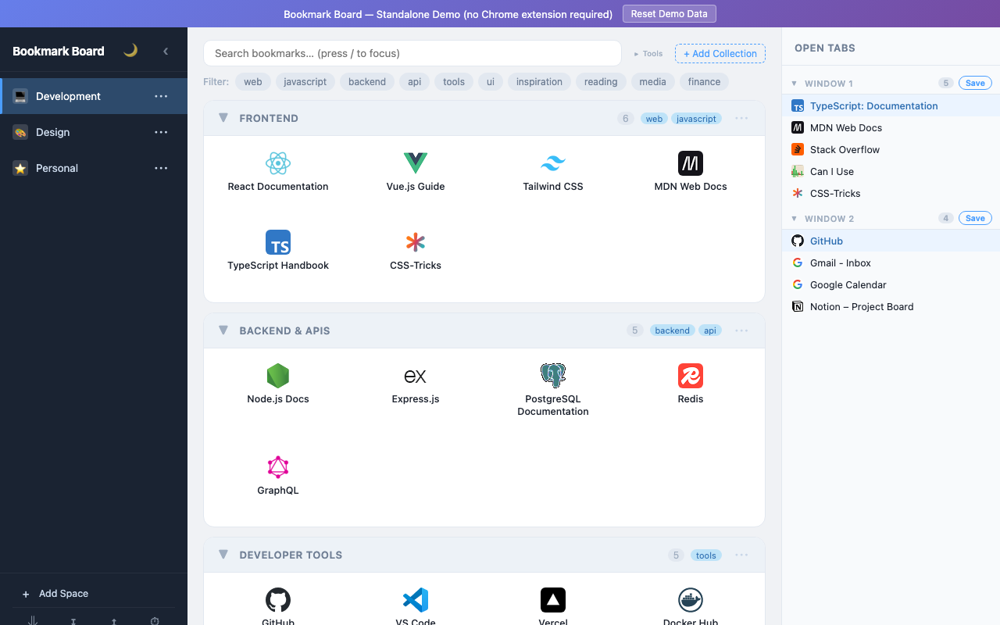

# Bookmark Board

A Chrome extension that replaces your New Tab page with a powerful bookmark manager featuring drag-and-drop organization, AI-powered grouping, and open tabs integration.

  



## Features

- **Three-panel layout** — spaces/collections sidebar, bookmark grid, and open tabs panel
- **Spaces & Collections** — organize bookmarks into workspaces with nested collections and tags
- **Drag & Drop** — reorder bookmarks, move them between collections, drag open tabs to save them, reorder collections across spaces
- **AI-powered grouping** — automatically organize bookmarks using Claude, GPT-4o, or Gemini
- **Selective bookmark import** — pick folders from Chrome's bookmark bar with a checklist UI
- **Open tabs sidebar** — live view of all tabs across windows with one-click navigation
- **Search** — real-time filtering across all bookmarks (`/` to focus, `Esc` to clear)
- **Dark mode** — toggle between light and dark themes
- **Export & Restore** — full JSON backup and restore
- **Zero dependencies** — vanilla JavaScript, no build step required

## Installation

### From source (developer mode)

1. **Download the extension**

   ```sh
   git clone https://github.com/nicenfun/bookmark-board.git
   ```

   Or download and extract the [latest ZIP from GitHub](https://github.com/nicenfun/bookmark-board/releases).

2. **Load into Chrome**

   - Open `chrome://extensions/` in your browser
   - Enable **Developer mode** (toggle in the top-right corner)
   - Click **Load unpacked**
   - Select the `bookmark_board` directory you cloned or extracted

3. **Open a new tab** — Bookmark Board replaces your default new tab page automatically.

## Usage

### Organizing bookmarks

- **Create a space** — click the `+` button next to "Spaces" in the left sidebar
- **Create a collection** — click `+ Collection` inside a space
- **Add a bookmark** — click `+ Add` on any collection, enter a title and URL
- **Drag & drop** — drag bookmarks between collections, or drag open tabs from the right sidebar directly into a collection
- **Reorder** — drag collection headers to rearrange them; drag collections between spaces
- **Tags** — add tags to collections for quick filtering
- **Right-click** — context menus on spaces, collections, and bookmarks for rename, delete, and move options

### Importing from Chrome

1. Click the **Import** button in the header
2. Check the folders you want to import from your bookmark bar
3. Click **Import Selected**

### AI-powered organization

1. Open **Settings** (gear icon)
2. Enter an API key for your preferred provider:
   - **Anthropic** (Claude) — get a key at [console.anthropic.com](https://console.anthropic.com/)
   - **OpenAI** (GPT-4o) — get a key at [platform.openai.com](https://platform.openai.com/)
   - **Google** (Gemini) — get a key at [aistudio.google.com](https://aistudio.google.com/)
3. Select a model and click the AI grouping button on any collection
4. The AI will analyze your bookmarks and suggest organized groups

### Backup & Restore

- **Export** — click the export button to download all your data as a JSON file
- **Restore** — click restore and select a previously exported JSON file

### Keyboard shortcuts

| Key | Action |
|-----|--------|
| `/` | Focus search |
| `Escape` | Clear search / close modals |

## Privacy

- All bookmark data is stored locally in Chrome's extension storage — nothing is sent to external servers
- AI features only send bookmark titles and URLs to the provider you configure, and only when you explicitly trigger grouping
- API keys are stored in Chrome's secure local extension storage

## Requirements

- Google Chrome (or any Chromium-based browser that supports Manifest V3)
- No build tools, Node.js, or other dependencies required

## Development

The extension is built with vanilla JavaScript and requires no build step. To develop:

1. Load the extension as described in [Installation](#installation)
2. Edit files directly — HTML, CSS, and JS are loaded as-is
3. Reload the extension on `chrome://extensions/` (or press the reload button) to see changes

### Project structure

```
bookmark_board/
├── manifest.json       # Chrome MV3 extension manifest
├── newtab.html         # Entry point (three-panel layout)
├── newtab.css          # Styles with dark mode support
├── newtab.js           # Bootstrap and event wiring
├── js/
│   ├── utils.js        # Helpers (uid, favicon, debounce)
│   ├── store.js        # Data layer (CRUD for spaces/collections/bookmarks)
│   ├── render.js       # UI rendering
│   ├── bookmarks.js    # Bookmark operations
│   ├── collections.js  # Collection operations
│   ├── spaces.js       # Space operations
│   ├── import.js       # Chrome bookmark bar importer
│   ├── backup.js       # Export/restore
│   ├── tabs.js         # Open tabs sidebar
│   ├── dragdrop.js     # Drag-and-drop handler
│   ├── storage.js      # Chrome storage wrapper
│   └── ai-grouping.js  # AI-powered bookmark organization
└── icons/              # Extension icons
```

## License

Dual-licensed under your choice of:

- [MIT License](LICENSE-MIT)
- [Apache License 2.0](LICENSE-APACHE)
